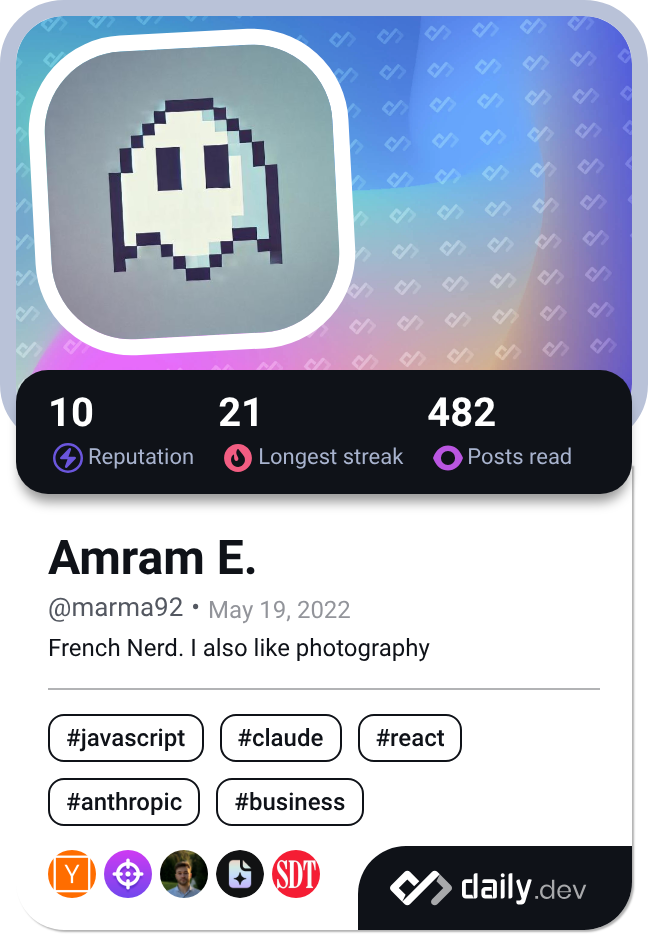

<h1 align="center">Hi 👋, I'm Amram</h1>
<h3 align="center">A passionate fullstack developper from Paris, France</h3>

- 🔭 I’m currently working on an auto-hosted hi-fi music streaming library: [flaque](https://github.com/Marma92/flaque)

- 🌱 I’m currently learning **Advanced architectures**

- 👨‍💻 All of my projects are available at [amramelbaz.com](http://amramelbaz.com)

- 📫 How to reach me **elbaza.dev[at]gmail.com**

- 📄 Know about my experiences [linkedin.com/in/aelbz/](https://www.linkedin.com/in/aelbz/)

<h3 align="center">I am also an unstoppable reader</h3>

<h3 align="center">Connect with me:</h3>

